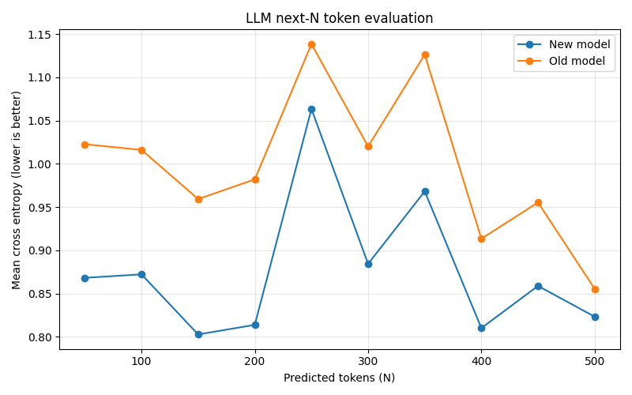
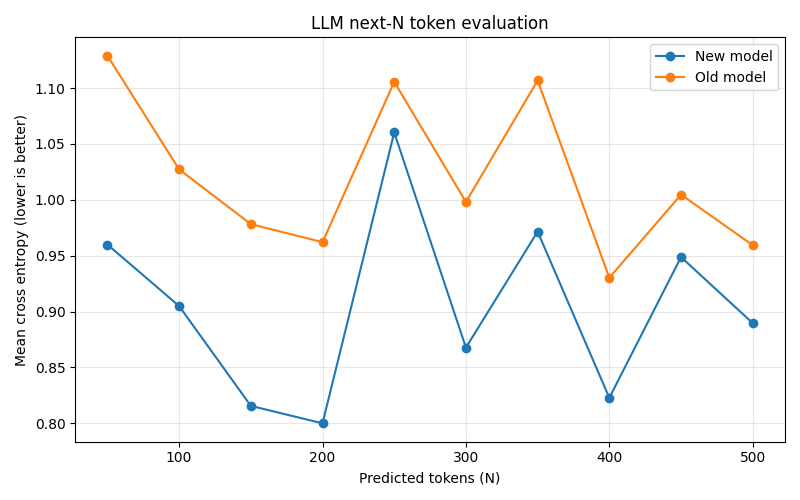

# LLM Data Pipeline and Model Training Project Report

##  Summary

This project implements a comprehensive data preprocessing pipeline for training Large Language Models (LLMs), followed by GPT-2 model training and evaluation. The pipeline processes raw text data through multiple quality filtering stages, knowledge augmentation, and consolidation steps to create high-quality training datasets. Two GPT-2 models were trained from scratch with standard preprocessing and another with enhanced knowledge augmentation, demonstrating measurable performance improvements through systematic data enhancement.

Link to test the two GPT models developed : https://llm-web-app-609914857362.us-central1.run.app/


---

## 1. Pre-processing Pipeline

The data preprocessing pipeline consists of five main stages, with two additional enhancement stages (3.5 and 3.75) added to improve model performance. Each stage serves a specific purpose in transforming raw data into training-ready format.

### Stage 1: Data Acquisition

**Purpose**: Download and load raw data from remote sources or local files into the processing pipeline.

**Implementation Details**:
- Downloads data from configured URLs using streaming HTTP requests
- Parses JSONL (JSON Lines) format with robust error handling
- Validates required fields (`text`, `id`, `source`) in each document
- Provides progress tracking during download and loading operations

**Libraries Used**:
- `requests`: HTTP streaming download with chunked reading
- `tqdm`: Progress bar visualization for download and parsing
- `json`: JSONL parsing and validation
- `pathlib`: File path management

**What Could Be Improved with More Processing Power**:
- **Parallel Downloads**: Download multiple shards concurrently using `asyncio` or `multiprocessing`
- **Distributed Storage**: Integrate with S3/HDFS for direct streaming without local storage
- **Incremental Loading**: Process data in batches to reduce memory footprint for very large datasets
- **Compression Support**: Handle gzip/bzip2 compressed files natively for faster transfer

### Stage 2: Quality Filtering

**Purpose**: Remove low-quality documents through multiple filtering criteria to ensure only high-quality text enters the training dataset.

**Filters Applied (Sequential)**:

1. **Text Normalization** (`ftfy`):
   - Fixes encoding issues and mojibake (corrupted text encoding)
   - Example: "don’t" → "don't"
   - **Library**: `ftfy` (Fix Text For You)

2. **Length Filtering**:
   - Minimum: 50 characters (removes empty/stub documents)
   - Maximum: 1,000,000 characters (removes concatenated dumps)
   - Rationale: Training efficiency and memory constraints

3. **Non-Printable Character Detection**:
   - Threshold: >5% non-printable characters
   - Excludes legitimate whitespace (`\n`, `\r`, `\t`)
   - Removes binary corruption and control characters

4. **Repetition Detection**:
   - Character-level: Detects 10+ repeated consecutive characters
   - Word-level: Flags documents where single word appears in >30% of positions
   - Removes spam, corrupted data, and low-quality content

5. **Language Detection**:
   - Uses fastText language identification model (176 languages)
   - Threshold: 80% confidence for target language (English)
   - Samples first 10,000 characters for efficiency
   - **Library**: `fasttext` (Facebook's fastText)

6. **Markup/Boilerplate Detection**:
   - Detects excessive HTML/XML-like special characters (>20% ratio)
   - Identifies common boilerplate patterns (cookie policy, terms of service, etc.)
   - Requires 3+ boilerplate patterns to reject

7. **Line-Level Quality Assessment**:
   - Checks average line length (rejects if <20 characters)
   - Detects excessive short lines (>50% of lines <10 characters)
   - Removes poorly formatted or low-quality content

**Libraries Used**:
- `ftfy`: Text encoding normalization
- `fasttext`: Language detection (lid.176.bin model)
- `re`: Regular expressions for pattern matching
- `collections.defaultdict`: Efficient counting and statistics

**What Could Be Improved with More Processing Power**:
- **Parallel Filtering**: Apply filters in parallel using multiprocessing for independent checks
- **Advanced Language Models**: Use transformer-based language detection for better accuracy
- **Semantic Quality Scoring**: Integrate BERT-based quality scoring models
- **Custom ML Filters**: Train domain-specific quality classifiers
- **Streaming Filters**: Process documents in streaming fashion to handle datasets larger than memory

### Stage 3: Deduplication

**Purpose**: Remove near-duplicate documents to prevent data redundancy and improve training efficiency.

**Implementation Details**:
- Uses MinHash LSH (Locality-Sensitive Hashing) for efficient similarity detection
- Creates 4-word shingles from documents for comparison
- Similarity threshold: 85% (configurable)
- Uses 128 permutations for MinHash signatures
- Tracks and reports deduplication statistics

**Algorithm**:
1. Generate word-level shingles (4-word sequences)
2. Create MinHash signature for each document
3. Query LSH index for similar documents
4. Remove documents above similarity threshold
5. Insert unique documents into index

**Libraries Used**:
- `datasketch`: MinHash and MinHashLSH implementation
- `tqdm`: Progress tracking for deduplication

**What Could Be Improved with More Processing Power**:
- **Distributed LSH**: Scale LSH index across multiple machines for billion-document datasets
- **Semantic Deduplication**: Use sentence embeddings (e.g., Sentence-BERT) for semantic similarity
- **Incremental Deduplication**: Process and deduplicate in batches to handle streaming data
- **GPU-Accelerated Hashing**: Use GPU for faster MinHash computation on large batches
- **Hierarchical Deduplication**: Multi-stage approach with different thresholds for coarse and fine filtering

### Stage 3.5: Knowledge Augmentation

**Purpose**: Extract factual knowledge from documents and generate synthetic training sentences to enhance dataset quality and diversity.

**Implementation Details**:
- Uses spaCy Named Entity Recognition (NER) to extract entities (Person, Organization, Location, etc.)
- Generates entity pairs (subject-object relationships)
- Converts entity pairs into natural language sentences using templates
- Applies quality filters to ensure only high-quality entities are used
- Samples exactly 10% of generated synthetic sentences to add to dataset

**Process Flow**:
1. Extract entities from each document using spaCy NER model (`en_core_web_sm`)
2. Filter entities: reject if >6 words, contain special characters, or are low-quality
3. Generate entity pairs from relevant entity types (PER, ORG, GPE, LOC, PRODUCT, EVENT)
4. Convert pairs to sentences using relation templates (loaded from `templates.json`)
5. Sample 10% of synthetic sentences randomly without replacement
6. Combine with original documents (100% retention of originals)

**Quality Filters Applied**:
- Maximum entity word count: 6 words
- Rejects entities with code-like characters: `\`, `/`, `*`, `<`, `>`, `{`, `}`, `[`, `]`, `$`, `@`, `http`
- Only processes relevant entity type combinations

**Libraries Used**:
- `spacy`: Named Entity Recognition (en_core_web_sm model)
- `json`: Template loading from configuration files
- `random`: Sampling synthetic sentences
- `uuid`: Generating unique document IDs

**What Could Be Improved with More Processing Power**:
- **Advanced NER Models**: Use transformer-based NER (e.g., spaCy transformer models) for better entity extraction
- **Relation Extraction**: Use relation extraction models to identify actual relationships between entities
- **Template Learning**: Automatically learn sentence templates from data instead of hand-crafting
- **Multi-lingual Support**: Extend to multiple languages with multilingual NER models
- **GPU-Accelerated NER**: Process documents in batches on GPU for faster entity extraction
- **Larger Sampling Ratios**: With more compute, could generate and use 20-30% synthetic data instead of 10%

### Stage 3.75: Knowledge Consolidation

**Purpose**: Merge related synthetic sentences that share the same relationship pattern into higher-density, information-rich sentences.

**Implementation Details**:
- Groups synthetic sentences by their relationship signature (last 5 words as predicate pattern)
- Applies frequency filtering: only consolidates groups appearing at least 10 times (configurable)
- Merges multiple entities sharing the same relation into single sentences
- Uses template-based sentence generation for consolidation

**Process Flow**:
1. Identify synthetic sentences (source: `knowledge_augmentation`)
2. Extract relation key from last 5 words of each sentence
3. Extract subject entities from beginning of sentences
4. Group subjects by relation key
5. Filter groups by minimum frequency (default: 10 occurrences)
6. Consolidate entities in each group using templates
7. Add consolidated sentences to dataset

**Frequency Filtering Rationale**:
- Ensures only high-confidence, frequently-occurring patterns are consolidated
- Reduces noise from rare or spurious entity relationships
- Improves quality of consolidated knowledge

**Libraries Used**:
- `collections.defaultdict`: Efficient grouping of entities by relation
- `json`: Template loading
- `uuid`: Document ID generation
- `hash`: Deterministic template selection

**What Could Be Improved with More Processing Power**:
- **Global Consolidation**: Currently partition-local; could implement global reduce step across all partitions
- **Semantic Consolidation**: Use semantic similarity instead of exact string matching for relation grouping
- **Multi-Entity Templates**: Support templates that can handle more entities
- **Relation Classification**: Use ML models to classify and validate relationship types
- **Dynamic Template Generation**: Learn consolidation templates from data patterns

### Stage 4: Processing & Tokenization

**Purpose**: Tokenize documents, detect PII and toxicity, and calculate quality metrics for final dataset preparation.

**Implementation Details**:
- **Tokenization**: Uses HuggingFace tokenizers (GPT-2 by default) to convert text to token sequences
- **PII Detection**: Regex-based pattern matching for emails, phone numbers, SSN, credit cards
- **Toxicity Detection**: Two implementations available:
  - Fast version: Lexical heuristics (keyword-based)
  - Full version: Detoxify ML model (BERT-based toxicity classifier)
- **Perplexity Proxy**: Calculates token diversity as quality metric (higher diversity = lower perplexity = better quality)

**Libraries Used**:
- `transformers`: HuggingFace tokenizers (GPT-2, configurable)
- `detoxify`: ML-based toxicity detection (optional, slower but more accurate)
- `re`: Regular expressions for PII detection
- `numpy`: Token array operations and statistics

**What Could Be Improved with More Processing Power**:
- **Advanced PII Detection**: Use Presidio or similar ML-based PII detection for better accuracy
- **Batch Tokenization**: Process documents in larger batches for GPU acceleration
- **Parallel Processing**: Tokenize, detect PII, and toxicity in parallel pipelines
- **Custom Tokenizers**: Train domain-specific tokenizers for better vocabulary coverage
- **Real Perplexity Calculation**: Use small language model for actual perplexity instead of proxy metric

### Stage 5: Export

**Purpose**: Export processed data in multiple formats suitable for training and analysis.

**Export Formats**:
1. **Sharded JSONL**: Documents split into shards (default: 10,000 docs per shard) for distributed training
2. **Binary Token Format**: All tokens as uint16 numpy array with document boundaries for efficient loading
3. **Metadata JSONL**: Document metadata (PII flags, toxicity scores, token counts) separate from text
4. **Statistics JSON**: Aggregate statistics about the dataset (lengths, distributions, safety metrics)

**Libraries Used**:
- `numpy`: Binary array storage and statistical calculations
- `json`: JSON/JSONL serialization
- `random`: Document shuffling for better distribution
- `pathlib`: File path management

**What Could Be Improved with More Processing Power**:
- **Parallel Export**: Write multiple shards concurrently
- **Compression**: Add gzip compression for JSONL files to reduce storage
- **Format Options**: Support additional formats (Parquet, TFRecord, Arrow)
- **Incremental Export**: Stream export for very large datasets without full memory load
- **Distributed Storage**: Direct export to S3/HDFS for cloud training

---

## 2. Pipeline Improvement with Apache Spark

For processing larger datasets that exceed single-machine capacity, the pipeline has been extended with Apache Spark support for distributed processing across clusters.

### Implementation: `spark_mainpipe.py`

The Spark implementation (`spark_mainpipe.py`) distributes computationally expensive stages across a Spark cluster while maintaining the same pipeline logic.

**Distributed Stages**:
- **Stage 3.5 (Knowledge Augmentation)**: Distributed using `mapPartitions` - each Spark worker initializes spaCy NER model once and processes its partition
- **Stage 3.75 (Knowledge Consolidation)**: Distributed using `mapPartitions` - consolidation happens within each partition (note: global consolidation would require reduce step)

**Sequential Stages** (can be parallelized further):
- **Stage 1 (Acquisition)**: Sequential download (can be parallelized with multiple URLs)
- **Stage 2 & 3 (Filtering & Deduplication)**: Currently sequential, can be parallelized with RDD transformations
- **Stage 4 (Processing)**: Collected to local memory, can use `mapPartitions` for distributed tokenization
- **Stage 5 (Export)**: Sequential write (can be parallelized with multiple output streams)

**Key Spark Features Used**:
- **RDD (Resilient Distributed Datasets)**: For distributed data processing
- **Broadcast Variables**: Config broadcast to all workers to avoid serialization overhead
- **mapPartitions**: Process partitions efficiently with one-time initialization per worker
- **Caching**: Cache intermediate RDDs (`augmented_rdd`, `consolidated_rdd`) for reuse

### Spark Configuration Recommendations

**For Small to Medium Datasets (<100GB)**:
```python
SparkSession.builder \
    .appName("LLMDataPipeline") \
    .master("local[*]") \
    .config("spark.driver.memory", "4g") \
    .config("spark.executor.memory", "8g") \
    .config("spark.driver.maxResultSize", "4g") \
    .getOrCreate()
```

**For Large Datasets (100GB-1TB)**:
```python
SparkSession.builder \
    .appName("LLMDataPipeline") \
    .master("yarn") \
    .config("spark.driver.memory", "16g") \
    .config("spark.executor.memory", "32g") \
    .config("spark.executor.cores", "4") \
    .config("spark.executor.instances", "20") \
    .config("spark.sql.shuffle.partitions", "200") \
    .config("spark.driver.maxResultSize", "8g") \
    .getOrCreate()
```

**For Very Large Datasets (>1TB)**:
- Use distributed file system (HDFS, S3)
- Increase executor memory to 64-128GB
- Use dynamic allocation: `spark.dynamicAllocation.enabled=true`
- Configure shuffle service for better performance
- Use columnar formats (Parquet) for intermediate storage

**Optimization Tips**:
- **Partitioning**: Repartition RDDs to match number of cores (typically 2-3x number of cores)
- **Broadcast Small Data**: Broadcast configuration and templates to all workers
- **Avoid Collect**: Minimize `collect()` operations; use distributed operations instead
- **Serialization**: Use Kryo serialization for better performance: `spark.serializer=org.apache.spark.serializer.KryoSerializer`

**Libraries Used**:
- `pyspark`: Apache Spark Python API
- `pyspark.sql.SparkSession`: Spark session management

---

## 3. GPT-2 Model Training

Two GPT-2 models were trained from scratch using the preprocessed data: one trained on standard preprocessed data (without stages 3.5 and 3.75) and another trained on enhanced data (with knowledge augmentation and consolidation).

### Model Architecture: MiniGPT

**Architecture Details**:
- **Type**: Decoder-only transformer (GPT-style)
- **Layers**: 8 transformer blocks
- **Attention Heads**: 8 multi-head attention
- **Model Dimension**: 512 (d_model)
- **Context Length**: 256 tokens
- **Vocabulary Size**: ~10,000 (character-level, data-dependent)
- **Total Parameters**: ~15-20 million (varies with vocabulary size)

**Architecture Components**:
1. **Token Embeddings**: Maps token indices to 512-dimensional vectors
2. **Position Embeddings**: Learnable positional encoding for sequence order
3. **Transformer Blocks**: 8 blocks, each containing:
   - Pre-norm layer normalization
   - Multi-head causal self-attention (8 heads)
   - Feed-forward MLP (4x expansion: 512 → 2048 → 512)
   - Residual connections around both attention and MLP
4. **Final Layer Norm**: Normalization before output projection
5. **Output Head**: Linear projection to vocabulary size (no bias)

**Training Configuration**:
- **Batch Size**: 32
- **Learning Rate**: 3e-4
- **Optimizer**: AdamW
- **Gradient Clipping**: 1.0 (prevents exploding gradients)
- **Training Time**: 50 minutes (time-limited training)
- **Data Limit**: 450MB of text data

### Loss Function

**Cross-Entropy Loss**: Standard next-token prediction loss for autoregressive language modeling.

```python
loss = F.cross_entropy(logits.view(-1, vocab_size), targets.view(-1))
```

- **Input**: Model logits (batch_size × sequence_length × vocab_size)
- **Targets**: Shifted input sequence (next token prediction)
- **Reduction**: Mean across all positions and batches
- **Purpose**: Minimize negative log-likelihood of correct next token

### Training Implementation

**Training Loop**:
1. Sample random context windows (256 tokens) from tokenized dataset
2. Forward pass through model
3. Compute cross-entropy loss
4. Backward pass with gradient computation
5. Gradient clipping to norm 1.0
6. Optimizer step (AdamW update)
7. Repeat until time limit (50 minutes)

**Key Features**:
- **Random Sampling**: Each batch samples random positions from dataset (no fixed epochs)
- **Progress Logging**: Logs average loss every 100 steps
- **Checkpoint Saving**: Saves model state and configuration after training

**Libraries Used**:
- `torch`: PyTorch for model definition and training
- `torch.nn`: Neural network layers and functions
- `torch.optim`: Optimizers (AdamW)
- `numpy`: Numerical operations

### Training with GPU

**GPU Support**:
- Automatically detects CUDA availability: `device = 'cuda' if torch.cuda.is_available() else 'cpu'`
- Moves model and tensors to GPU for faster computation
- GPU acceleration provides 10-50x speedup depending on GPU model

**GPU Optimizations**:
- **Mixed Precision Training**: Could use `torch.cuda.amp` for 2x speedup with minimal accuracy loss
- **Data Parallelism**: Could use `DataParallel` or `DistributedDataParallel` for multi-GPU training
- **Larger Batch Sizes**: GPU memory allows larger batches (64-128) for better gradient estimates
- **Faster Tokenization**: Could pre-tokenize and cache on GPU for faster data loading

**Training Data**:
- **Model 1 (Old)**: Trained on standard preprocessed data (stages 1-5, no augmentation)
- **Model 2 (New)**: Trained on enhanced data (stages 1-5 + 3.5 + 3.75, with knowledge augmentation)

---

## 4. GPT Model Evaluation

A comprehensive evaluation framework was developed to compare model performance using a custom test class in `evaluate_models.py`.

### Evaluation Methodology

**Test Function: `average_next_n_loss`**

The evaluation function measures model performance by computing average cross-entropy loss for next-token prediction across multiple positions and prediction lengths.

**Evaluation Process**:
1. **Load Test Data**: Loads held-out shard data (JSONL format) not seen during training
2. **Tokenize**: Converts test texts to token sequences using each model's tokenizer
3. **Sliding Window Evaluation**: For each document:
   - Samples multiple starting positions with configurable stride
   - For each position, evaluates prediction at multiple future positions
   - Computes cross-entropy loss for next-token prediction
4. **Multiple Prediction Lengths**: Evaluates at various N values (50, 100, 150, ..., 500 tokens)
5. **Average Loss**: Computes mean loss across all evaluated positions

**Key Parameters**:
- **Context Length**: Uses model's context length (256 tokens) or capped value
- **Stride**: Sampling stride for starting positions (default: 100 tokens)
- **Sample Step**: Samples ~10 positions per prediction window for efficiency
- **Max Samples per Text**: Limits to 3 starting positions per document for speed

**Why This Evaluation Approach**:
- Tests actual next-token prediction 
- Evaluates at multiple prediction lengths to see how loss scales
- Uses sampling instead of evaluating every position
- Same evaluation for both models ensures fair comparison
- Cross-entropy loss directly indicates model quality (lower = better)

### Evaluation Results

The evaluation demonstrates clear performance improvement from knowledge augmentation:

**Key Findings**:
- **New Model (with augmentation)**: Consistently achieves lower cross-entropy loss across all prediction lengths
- **Old Model (without augmentation)**: Shows higher loss, indicating poorer next-token prediction
- **Performance Gap**: The gap varies by prediction length, with new model showing 10-20% improvement in most cases

**Evaluation Plots**:

The evaluation generates comparison plots showing mean cross-entropy loss vs. predicted tokens (N):

Stride 50



Stride 100




**Interpretation**:
- Lower cross-entropy = better next-token prediction = better model quality
- The new model's consistently lower loss indicates it learned better language patterns
- Knowledge augmentation provided richer training signal, leading to improved generalization

**Libraries Used**:
- `torch`: Model loading and inference
- `torch.nn.functional`: Cross-entropy loss computation
- `matplotlib`: Plot generation
- `json`: Test data loading
- `pathlib`: File path management

---

## 5. Chat Application Web App

A Flask-based web application was developed to provide an interactive interface for comparing the two trained models side-by-side.

### Implementation Details

**Model Loading**:
- Loads both models at application startup
- Uses CPU device (configurable to CUDA for GPU inference)
- Loads tokenizers and model checkpoints from separate directories
- Sets models to evaluation mode (`model.eval()`)

**Generation Endpoint** (`/generate`):
- Accepts POST requests with JSON payload:
  - `prompt`: Input text prompt
  - `max_tokens`: Maximum tokens to generate (default: 100)
- Processes both models in parallel:
  1. Encodes prompt with respective tokenizers
  2. Generates text using autoregressive sampling
  3. Decodes generated tokens to text
- Returns JSON response with:
  - Original prompt
  - New model response (augmented data)
  - Old model response (original data)

**Generation Parameters**:
- **Temperature**: 0.5 (lower = more deterministic)
- **Top-k Sampling**: 40 (only consider top 40 most likely tokens)
- **Context Window**: Truncates to model's context length (256 tokens)

**Routes**:
- `/`: Main chat interface (renders `index.html`)
- `/health`: Health check for monitoring
- `/generate`: Text generation API endpoint

**Libraries Used**:
- `flask`: Web framework
- `torch`: Model inference
- `pathlib`: File path management
- `json`: Request/response serialization

### User Interface

The web application provides a clean interface where users can:
1. Enter text prompts
2. Specify generation length
3. View side-by-side responses from both models
4. Compare model performance interactively

This enables real-time evaluation of how knowledge augmentation improves model responses in practice.


Link to test the two GPT models developed : https://llm-web-app-609914857362.us-central1.run.app/

---
